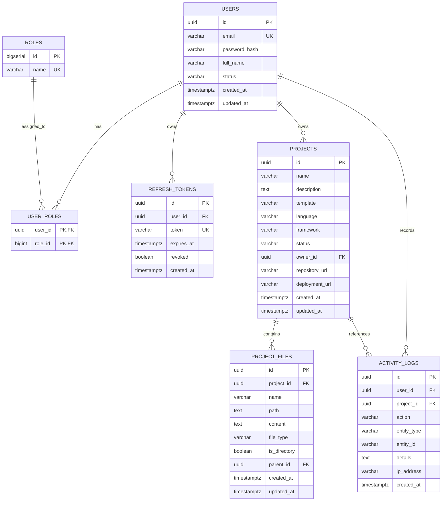

# DevPilot AI — Database Design & Schema Specification

## 1. Database Overview
* **Database Management System:** PostgreSQL 16+ (Standard relational database engine)
* **Migration Framework:** Flyway (Version-controlled DDL migrations in `db/migration/`)
* **ORM / Data Access:** Spring Data JPA / Hibernate 6 with `hibernate.ddl-auto: validate`
* **Primary Key Strategy:** UUID (`gen_random_uuid()` in PostgreSQL) for distributed scalability, zero sequential ID enumeration, and uniform entity identity across distributed nodes.
* **Design Standards:** 3rd Normal Form (3NF), foreign key referential integrity with explicit cascading strategies, composite unique indexes to prevent duplication, B-tree indexes on lookup columns, and strict UTC timestamping (`TIMESTAMP WITH TIME ZONE`).

---

## 2. Entity-Relationship Model



---

## 3. Flyway Migration Versioning

Database versioning is managed strictly through Flyway scripts located at `backend/src/main/resources/db/migration/` and mirrored in `database/migrations/`:

| Version | Migration Script | Description |
|---|---|---|
| **V1** | `V1__create_users_and_roles.sql` | Creates `users`, `roles`, `user_roles` tables, indexes, and seeds `ROLE_USER` & `ROLE_ADMIN` |
| **V2** | `V2__create_projects.sql` | Creates `projects` table with foreign key to `users(id)`, constraints, and status indexes |
| **V3** | `V3__create_project_files.sql` | Creates `project_files` with self-referencing tree structure and unique `(project_id, path)` index |
| **V4** | `V4__create_refresh_tokens.sql` | Creates `refresh_tokens` for secure JWT session rotation and token revocation |
| **V5** | `V5__create_activity_logs.sql` | Creates `activity_logs` audit log table for tracing user events and workspace operations |

---

## 4. Detailed Table Specifications

### 4.1 `users`
Represents developer user accounts with role-based access.

| Column | Type | Constraints | Description |
|---|---|---|---|
| `id` | UUID | PRIMARY KEY, DEFAULT gen_random_uuid() | Unique identifier |
| `email` | VARCHAR(255) | NOT NULL, UNIQUE | User email address (login credential) |
| `password_hash` | VARCHAR(255) | NOT NULL | BCrypt hashed password |
| `full_name` | VARCHAR(120) | NOT NULL | User's full display name |
| `status` | VARCHAR(30) | NOT NULL, DEFAULT 'ACTIVE' | Status: `ACTIVE`, `INACTIVE`, `SUSPENDED` |
| `created_at` | TIMESTAMPTZ | NOT NULL, DEFAULT CURRENT_TIMESTAMP | Registration timestamp |
| `updated_at` | TIMESTAMPTZ | NOT NULL, DEFAULT CURRENT_TIMESTAMP | Last modification timestamp |

* **Indexes:**
  * `idx_users_email` ON `users(email)`
  * `idx_users_status` ON `users(status)`

---

### 4.2 `roles` & `user_roles`
Normalized Role-Based Access Control (RBAC).

* **`roles`:**
  * `id`: BIGSERIAL PRIMARY KEY
  * `name`: VARCHAR(50) NOT NULL UNIQUE (`ROLE_USER`, `ROLE_ADMIN`)
* **`user_roles`:**
  * `user_id`: UUID NOT NULL REFERENCES `users(id)` ON DELETE CASCADE
  * `role_id`: BIGINT NOT NULL REFERENCES `roles(id)` ON DELETE CASCADE
  * PRIMARY KEY `(user_id, role_id)`

---

### 4.3 `projects`
Represents developer workspaces created within DevPilot AI.

| Column | Type | Constraints | Description |
|---|---|---|---|
| `id` | UUID | PRIMARY KEY, DEFAULT gen_random_uuid() | Project identifier |
| `name` | VARCHAR(120) | NOT NULL | Project title |
| `description` | TEXT | NULL | Project documentation/summary |
| `template` | VARCHAR(50) | NOT NULL, DEFAULT 'BLANK' | Starter template: `HTML_CSS_JS`, `JAVA_SPRING`, `PYTHON_FLASK`, `NODE_EXPRESS`, `REACT_SPA`, `BLANK` |
| `language` | VARCHAR(50) | NOT NULL | Primary language (JavaScript, Java, Python) |
| `framework` | VARCHAR(50) | NULL | Framework identifier |
| `status` | VARCHAR(30) | NOT NULL, DEFAULT 'ACTIVE' | Status: `ACTIVE`, `ARCHIVED`, `DELETED` |
| `owner_id` | UUID | NULL, REFERENCES `users(id)` ON DELETE SET NULL | Project owner |
| `repository_url` | VARCHAR(500) | NULL | External Git repository link |
| `deployment_url` | VARCHAR(500) | NULL | Live deployment URL |
| `created_at` | TIMESTAMPTZ | NOT NULL, DEFAULT CURRENT_TIMESTAMP | Created timestamp |
| `updated_at` | TIMESTAMPTZ | NOT NULL, DEFAULT CURRENT_TIMESTAMP | Last update timestamp |

* **Indexes:**
  * `idx_projects_owner_id` ON `projects(owner_id)`
  * `idx_projects_status` ON `projects(status)`
  * `idx_projects_name` ON `projects(name)`

---

### 4.4 `project_files`
Hierarchical virtual file system for the Monaco editor in the browser workspace.

| Column | Type | Constraints | Description |
|---|---|---|---|
| `id` | UUID | PRIMARY KEY, DEFAULT gen_random_uuid() | File entry UUID |
| `project_id` | UUID | NOT NULL, REFERENCES `projects(id)` ON DELETE CASCADE | Associated workspace |
| `name` | VARCHAR(255) | NOT NULL | File or directory name |
| `path` | TEXT | NOT NULL | Full path (e.g., `/src/index.js`) |
| `content` | TEXT | NULL | File text contents |
| `file_type` | VARCHAR(30) | NOT NULL, DEFAULT 'FILE' | `FILE` or `DIRECTORY` |
| `is_directory` | BOOLEAN | NOT NULL, DEFAULT false | Quick directory check |
| `parent_id` | UUID | NULL, REFERENCES `project_files(id)` ON DELETE CASCADE | Self-referencing tree parent |
| `created_at` | TIMESTAMPTZ | NOT NULL, DEFAULT CURRENT_TIMESTAMP | Creation timestamp |
| `updated_at` | TIMESTAMPTZ | NOT NULL, DEFAULT CURRENT_TIMESTAMP | Last modified timestamp |

* **Indexes & Constraints:**
  * `uq_project_file_path` UNIQUE `(project_id, path)`
  * `idx_project_files_project` ON `project_files(project_id)`
  * `idx_project_files_parent` ON `project_files(parent_id)`

---

### 4.5 `refresh_tokens`
Long-lived refresh token store for JWT session rotation.

| Column | Type | Constraints | Description |
|---|---|---|---|
| `id` | UUID | PRIMARY KEY, DEFAULT gen_random_uuid() | Token ID |
| `user_id` | UUID | NOT NULL, REFERENCES `users(id)` ON DELETE CASCADE | Owner user |
| `token` | VARCHAR(500) | NOT NULL, UNIQUE | Secure token hash |
| `expires_at` | TIMESTAMPTZ | NOT NULL | Expiry instant |
| `revoked` | BOOLEAN | NOT NULL, DEFAULT false | Immediate invalidation flag |
| `created_at` | TIMESTAMPTZ | NOT NULL, DEFAULT CURRENT_TIMESTAMP | Issuance timestamp |

* **Indexes:**
  * `idx_refresh_tokens_user` ON `refresh_tokens(user_id)`
  * `idx_refresh_tokens_token` ON `refresh_tokens(token)`

---

### 4.6 `activity_logs`
Audit and telemetry logging for user and workspace actions.

| Column | Type | Constraints | Description |
|---|---|---|---|
| `id` | UUID | PRIMARY KEY, DEFAULT gen_random_uuid() | Log event ID |
| `user_id` | UUID | NULL, REFERENCES `users(id)` ON DELETE SET NULL | Initiating user |
| `project_id` | UUID | NULL, REFERENCES `projects(id)` ON DELETE SET NULL | Target project |
| `action` | VARCHAR(100) | NOT NULL | Action name (`PROJECT_CREATED`, etc.) |
| `entity_type` | VARCHAR(50) | NULL | Entity type affected (`PROJECT`, `FILE`) |
| `entity_id` | VARCHAR(100) | NULL | Entity UUID string |
| `details` | TEXT | NULL | JSON or textual detail |
| `ip_address` | VARCHAR(45) | NULL | Client IP (IPv4/IPv6) |
| `created_at` | TIMESTAMPTZ | NOT NULL, DEFAULT CURRENT_TIMESTAMP | Event timestamp |

* **Indexes:**
  * `idx_activity_logs_user` ON `activity_logs(user_id)`
  * `idx_activity_logs_project` ON `activity_logs(project_id)`
  * `idx_activity_logs_action` ON `activity_logs(action)`

---

## 5. Local PostgreSQL Setup Guide

### 5.1 Prerequisites
* PostgreSQL 15+ installed locally or running via Docker.
* `psql` or pgAdmin available.

### 5.2 Create the Database
In PowerShell or Bash:
```bash
# Connect to PostgreSQL default database
psql -U postgres

# Create the devpilot database and grant privileges
CREATE DATABASE devpilot;
CREATE USER devpilot WITH ENCRYPTED PASSWORD 'devpilot_secret';
GRANT ALL PRIVILEGES ON DATABASE devpilot TO devpilot;
\q
```

### 5.3 Configure Environment Variables
Copy `.env.example` to `.env` in the project root:
```properties
DATABASE_URL=jdbc:postgresql://localhost:5432/devpilot
DATABASE_USERNAME=devpilot
DATABASE_PASSWORD=devpilot_secret
```

### 5.4 Running Migrations
When starting the Spring Boot backend (`mvn spring-boot:run` or `java -jar target/devpilot-backend-1.0.0-SNAPSHOT.jar`), Flyway automatically checks the database, creates the `flyway_schema_history` table, and executes `V1` through `V5` migrations in sequential order.

Hibernate then operates with:
```yaml
spring:
  jpa:
    hibernate:
      ddl-auto: validate
```
This ensures Hibernate **never alters or creates tables automatically at runtime**, guaranteeing full schema drift protection and strict version control.
